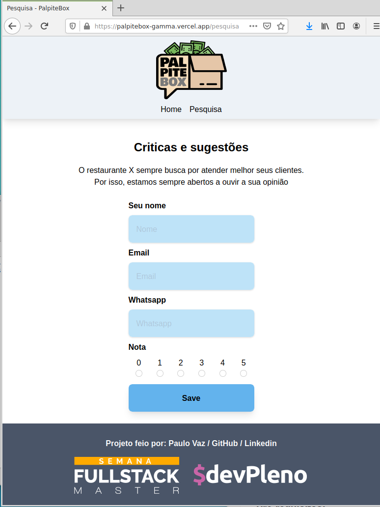
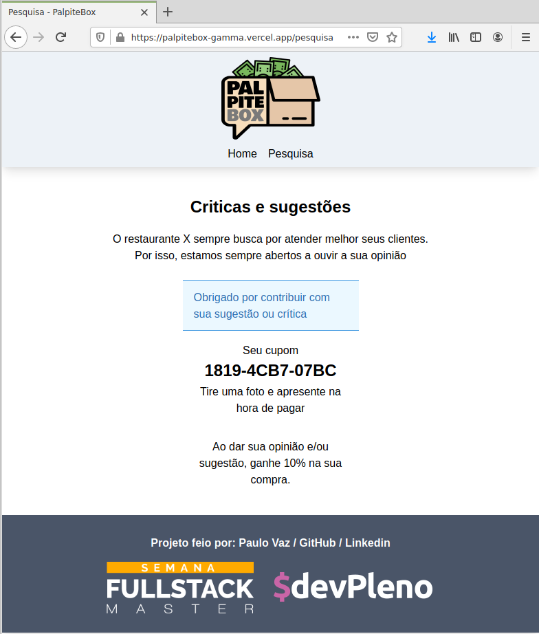

<h1 align="center">PalpiteBox</h1>
<br>

## Objetivo

<p>O projeto tem como objetivo fornecer um sistema a estabelecimentos comerciais no intuito que seus clientes possam opinar sobre o atendimento, produto etc. Em troca receberá um cupom (desconto, condição especial) </p>
<div style="display: flex; justify-content: center;">


</div>

## Tecnologias

Esse projeto foi desenvolvido com as seguintes tecnologias:

- [Node.js](https://nodejs.org/en/)
- [NextJs](https://nextjs.org/) - The React Framework.
- [Figma](https://figma.com/) - Online prototyping tool.
- [TailwindCSS ](https://tailwindcss.com/) - A utility-first CSS framework for rapidly building custom designs.


### Pré-requisitos:

Você precisa do NodeJS e do NPM instalado em sua máquina.

```
npm install
npm run dev
```

## Layout:

Criamos o layout utilizando o Figma. Você pode encontrar o arquivo [aqui](https://www.figma.com/file/HxvAYhS6l7UDI49u8uLdaC/palpite-box?node-id=0%3A1).

## Colocando em produção:

Este projeto pode ser colocado em produção utilizando o Vercel. É necessário criar as variáveis de ambiente para configurar o acesso as planilhas do Google:
```
SHEET_CLIENT_EMAIL=client email do service credential
SHEET_PRIVATE_KEY=private key do service credential - alteração de base para 64 e inclusão de uma função de conversão devido aos \n
SHEET_DOC_ID=id da planilha
```

## Como contribuir

- Faça um fork desse repositório;
- Cria uma branch com a sua feature: `git checkout -b minha-feature`;
- Faça commit das suas alterações: `git commit -m 'feat: Minha nova feature'`;
- Faça push para a sua branch: `git push origin minha-feature`.

Depois que o merge da sua pull request for feito, você pode deletar a sua branch.


## Author:

* **Paulo Vaz** - [LinkedIn](https://www.linkedin.com/in/paulo-vaz-05296a46/)


## Licença

Este projeto é licenciado sobre a licença MIT - veja [LICENSE.md](LICENSE.md) para mais informações.

## Acknowledgments

Este projeto foi construído durante as aulas do Fullstack Master do [DevPleno](https://devpleno.com).